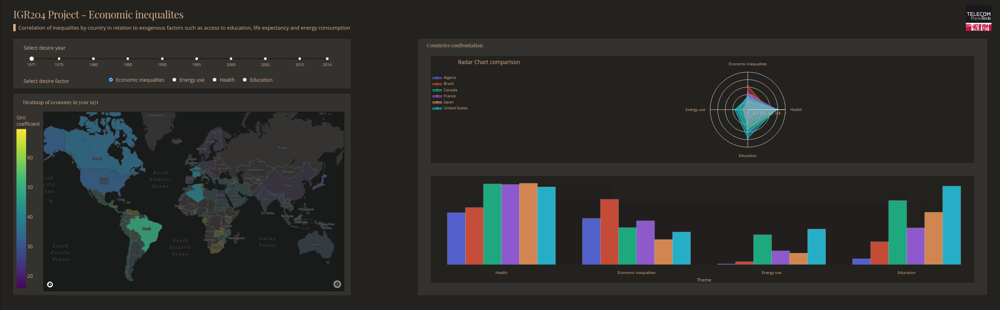

# Projet de visualisation : Inégalitées économiques
Auteurs : **Théo Lefievre**, **Vincent Poquet**, **Ernest Majdalani**,  **Morgan Fassier**, **Adrien Senet**

L'objectif de cette app est de pouvoir visualiser la corrélation des inégalités par pays par rapport à des facteurs exogènes tels que l'accès à l'éducation, l'espérance de vie, la consommation d'énergie, etc.

**Screenshot de l'app Dash :**  



## Données
Les données utilisées dans le cadre de ce projet sont issues de Gapminder, une entreprise
à but non lucratif, dont le but est la promotion du développement durable et des objectifs
du millénaire pour le développement de l’ONU.
Nous avons choisi le jeu de données Income Inequalities de Gapminder : nous souhaitons
créer des visualisations sur l’évolution des tendances sociales, économiques et environne-
mentales liées aux inégalités de revenus dans le monde.

## Installation de la web app Dash Plotly
## Prérequis
* Paquet Virtual Python Environment builder : [virtualenv](https://pypi.org/project/virtualenv/)
* [Python 3](https://www.python.org/downloads/)
## Utilisation
Clonez et rentrer dans le dossier *data-visualization-project* :
```
git clone https://github.com/ernestmajdalani/data-visualization-project.git
cd data-visualization-project
```
Afin de pouvoir utiliser l'application veuillez créer un environnement virtuel :
```
python3 -m virtualenv venv
```
Systèmes UNIX :
```
source venv/bin/activate
```
Windows :
```
venv\Scripts\activate
```
Veuillez ensuite installer les paquets requis : 
```
pip install -r requirements.txt
```
Enfin, exécutez le programme **main** : 
```
python3 main.py
```
Enfin, connectez-vous à l'app à l'adresse suivante :   
**http://127.0.0.1:8050/**.

## Livrables
Nous avons également produit:  
- Un **[poster](poster_dataviz.pdf)**   
- Un **[rapport](Final-Report_Projet_Visualisation_IGR204.pdf)**  

## Ressources

Inspiration, code snippets, etc.  
Ce projet s'appuie sur 1 des 100 open-source Dash apps disponible sur le github plotly/dash-sample-apps
* [dash-opioid-epidemic](https://github.com/plotly/dash-sample-apps/tree/main/apps/dash-opioid-epidemic)